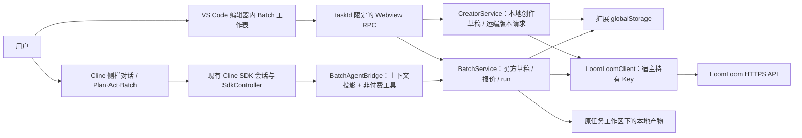

# Cline Chinese × LoomLoom Batch：研发迭代白皮书

> 版本：v1.0（2026-09-23） · 状态：供产品、Cline Chinese 研发与 LoomLoom 接口方共同评审的执行基线，**不是已上线声明**。
>
> 代码基线：[PR #7](https://github.com/SSYCloud/cline-chinese/pull/7)，提交 `38447bf`，VSIX `4.1.31`；目标分支 `ll`。
>
> 接口基线：用户提供的 `LoomLoom-API-接口总览-openapi (1).json`（`info.version=market-v1`，55 条路径、58 个操作）及[胜算云 LoomLoom API 文档](https://lean.shengsuanyun.com/apidocs/loomloom/api)。线上接口以服务端实际版本和响应为准。
>
> 相关文档：[PR 交接说明](PR-loomloom-batch-handoff.md)、[现有 Batch 设计说明](loomloom-batch-agent.md)、[文件适配 ADR](adr/0001-loomloom-file-adapters.md)、[VS Code 性能 ADR](adr/0002-vscode-batch-performance.md)、[Creator ADR](adr/0003-loomloom-creator-mode.md)。

## 0. 阅读方式与结论

这份文档既描述产品必须保留的行为，也给单人研发提供可拆分的工程任务和发布门禁。它不是要求研发逐行照搬 PR #7：**用户可观察的产品契约要保持，内部实现可以由研发重构**。建议先评审架构边界，再按纵向流程分批合入；新功能不继续无止境堆在一个 PR 上。

最重要的结论有五条：

1. **Batch Agent = 当前 Cline Act Agent + LoomLoom SkillBot/API + 批处理状态机。** Batch 不是第二套聊天。Act↔Batch 保留现有 SDK 会话；Plan→Batch 可能重建底层运行时，正常路径应沿用原会话 ID 与历史。若 SDK 返回新 ID，现代码可能重新键控 Batch 状态；发布前必须迁移关联或拒绝切换，不能仅宣称“逻辑同会话”而不验这个异常分支。
2. **一份输入、多处操作。** 左侧对话、Agent 工具与右侧 VS Code 工作表对同一个任务的同一份批量草稿操作；输入行可以增删，不能先锁死数量，也不能把 Excel 文件当作 Cline 的必需输入。
3. **付费与远端持久化动作必须有硬边界。** 当前 Batch 专用 Agent 工具只提供发现、草稿编辑与校验，不提供报价/执行/发布；但 Cline 通用 shell/网络工具仍存在，生产化还需审查宿主工具策略与凭据隔离，不能把 prompt 禁令当安全边界。输入检查、服务端预算、用户确认执行分别是不同阶段；修改输入后旧预算无效。
4. **PR #7 是“代码已接入 + 本地自动化通过”的产品验证实现，不是云端生产验收通过。** Market 真正扣费执行、Creator 私有试运行/审核、真实文件传输和 VS Code 长会话性能还需人工与服务端联调。
5. **步骤级实时进度是 LoomLoom 新接口需求。** 当前可展示 run/任务行状态；不能用 artifact 数、终态 stepErrors 或私有 Step ID 猜百分比，也不能向 Market 买方暴露创作者私有工作流结构。

### 0.1 状态词典

| 标记 | 本文含义 | 不代表什么 |
| --- | --- | --- |
| 已接入 | PR #7 中有对应源码、UI 和调用路径 | 不代表线上接口实测成功 |
| 本地已验证 | 类型检查、替身测试或本地 SDK 传输测试通过 | 不代表 VS Code 真机、真实账户或真实付费通过 |
| 待联调 | 需要安装 VSIX、真实服务响应、测试账户或维护者批准 CI | 不应在 README 中称为正式上线 |
| 新需求 | 当前 OpenAPI/代码没有完整契约或能力 | 不应让前端虚构状态或私自绕过权限 |

## 1. 目标、用户与范围

### 1.1 产品目标

- 让用户在现有 Cline 对话中调用可重复的 LoomLoom SkillBot 批量完成内容、代码、图像等工作，并让 Cline 保有聊天、引用文件、读取工作区和整理输入的能力。
- 用右侧深色 Batch 工作表承载多行输入、长结果、进度和历史；左侧保留 Agent 对话与关键状态。两侧不是两个任务。
- 支持用户创作私有工作流、私有测试、申请发布为 Market SkillBot，并在审核及结算规则下收费；**不得承诺审核通过或收入**。
- 保持 VS Code 扩展的响应性、资源限制、凭据隔离、文件系统边界与付费操作安全。

### 1.2 明确不做

- 不另建一个与原 Cline SDK 无关的 Batch Agent 或新会话；不把聊天完全替换为工作流商城页面。
- 不要求导入 `.xlsx`，也不把工作表实现成完整 Excel 公式引擎。工作表只是 Cline 内的表格交互组件；JSON 行输入是宿主对 LoomLoom 的内部协议。
- 不通过 Batch 专用 Agent 工具允许自动执行付费 run、创建私有模板、提交 Market 审核或重试结果不明的付费请求；通用工具的绕行风险列为发布前宿主策略审查。
- 不从 Market Listing 猜测隐藏 Prompt、内部步骤、私有 TemplateSpec 或步骤进度。
- 不把“拥有 API Key”混同于“完成浏览器登录”。已有有效 Key 可继续使用；缺失或失败时应给清楚的登录/配置路径。

### 1.3 单人研发的分工边界

| 角色 | 主要负责 | 本阶段应交付 |
| --- | --- | --- |
| Cline Chinese 研发（1 人） | 技术评审、等价重构、核心实现、CI/VSIX、上线与回滚 | 逐模块“保留/重构/依赖接口”清单、可运行分支、合并与发布记录 |
| 产品负责人 | 体验优先级、测试样本、需求澄清、验收签字 | 主流程验收记录、问题优先级、付费测试明确授权 |
| LoomLoom 接口方 | 服务端契约、鉴权/计费/状态解释、接口缺口 | 真实 listing/quote/run/Creator 响应样本、步骤级公开进度方案及版本说明 |

研发拥有实现方式与工期判断权；产品拥有用户旅程和验收结果判断权。若某段代码不适合合入，请给出**等价行为方案与排期**，而不是默默删除对应能力。

## 2. PR #7 的真实基线与证据

### 2.1 已接入的模块

| 能力 | 源码入口 / 权威组件 | 当前状态与剩余验证 |
| --- | --- | --- |
| Batch 产品模式与同一逻辑会话 | [`SdkController`](../apps/vscode/src/sdk/SdkController.ts)、[`vscode-session-host`](../apps/vscode/src/sdk/vscode-session-host.ts)、[`BatchAgentBridge`](../apps/vscode/src/services/loomloom/batch-agent-bridge.ts) | 已接入、本地 SDK 测试；需真机检验 Plan/Act/Batch 切换、长历史、运行中禁止切换及重建后 SDK 返回新会话 ID 的异常分支 |
| Market 买方草稿、报价与付费尝试 | [`BatchService`](../apps/vscode/src/services/loomloom/batch-service.ts) | `taskId` 键控、revision、quote 与 attempt 已接入；需真实 quote/execute 和异常响应联调 |
| 聊天 Batch 控件与事件 | [`BatchConversation`](../apps/vscode/webview-ui/src/components/loomloom/BatchConversation.tsx)、[`ChatView`](../apps/vscode/webview-ui/src/components/chat/ChatView.tsx) | 已嵌入原对话；需小屏、长消息、输入中切换等真机验收 |
| 独立工作表 | [`BatchTablePanel`](../apps/vscode/src/hosts/vscode/BatchTablePanel.ts)、[`BatchWorksheet`](../apps/vscode/webview-ui/src/components/loomloom/BatchWorksheet.tsx)、[`BatchTableService`](../apps/vscode/src/services/loomloom/table-operations.ts) | 第二个**视图**，不是第二个 Controller；需会话切换、隐藏/重开、只读旧表真机验收 |
| 市场与认证 | [`SkillBotMarket`](../apps/vscode/webview-ui/src/components/loomloom/SkillBotMarket.tsx)、[`skillBotCatalog`](../apps/vscode/src/core/controller/loomLoom/skillBotCatalog.ts)、[`LoomLoomClient`](../apps/vscode/src/services/loomloom/client.ts) | 已安装列表、市场入口、胜算云登录和 Key 路径已接入；需真实账户与公开 schema 样本验收 |
| 文件输入/本地产物 | [`input-file-adapter`](../apps/vscode/src/services/loomloom/input-file-adapter.ts)、[`output-file-adapter`](../apps/vscode/src/services/loomloom/output-file-adapter.ts)、[`output-coordinator`](../apps/vscode/src/services/loomloom/output-coordinator.ts) | 文本导入、素材上传与安全落盘代码已接入；需真实文件/失败/权限环境验收 |
| 创作模式 | [`CreatorService`](../apps/vscode/src/services/loomloom/creator-service.ts)、[`CreatorWorkbench`](../apps/vscode/webview-ui/src/components/loomloom/CreatorWorkbench.tsx)、[`creator-spec-v2`](../apps/vscode/webview-ui/src/components/loomloom/creator-spec-v2.ts) | 私有草稿→校验→保存版本→私有测试→审核申请请求链已接入；尚不能称真实服务端全流程已验证 |

“单一状态源”需要精确表达：**Market 买方 Batch 草稿/报价/run 的权威是 `BatchService`**；创作草稿另由 `CreatorService` 管理，安装索引另由 `SkillBotRegistry` 管理。它们同属扩展宿主，不应被误合并成 Webview 本地状态。

### 2.2 已验证与尚未验证

- 本地记录：`bun run test:batch-runtime` 9/9、`bun test src/services/loomloom` 195/195、Webview LoomLoom 组件 112/112。运行时测试使用本地模拟传输，不产生真实模型费或 LoomLoom 费用。
- 交接 VSIX：`4.1.31`，9,269,740 B；侧栏主 JS 5,065,409 B，独立工作表 JS 232,371 B。**这是字节数，不是启动耗时或性能承诺。** 打包预览 VSIX 内 README 来自 `apps/vscode/README.md`；正式 Marketplace 发布脚本会临时切换 `README.marketplace.md`，两种包都要核对内容。
- 当前 [PR #7 的 Checks](https://github.com/SSYCloud/cline-chinese/pull/7/checks) 尚非全绿：`Run Tests` 失败的根因未由公开页面证实；VS Code E2E 需要维护者批准/触发。`.github/workflows/ext-vscode-test.yml` 的 PR 触发分支仅覆盖 `main`，目标为 `ll` 的 PR 不能把“没跑”当“通过”。
- Windows 本地标准 `vscode:prepublish` 的 `lint:proto` 因缺失 WSL 未跑通；交接 VSIX 用相同 `vsce` 打包器的 `pack` 接口封装已编译产物。**正式合并/发布必须让 CI 完整构建、lint 和打包为绿。**
- ADR-0001、ADR-0002 记录了较早的 4.1.24/4.1.25 阶段，内含旧版号、旧产物尺寸及“尚未建 PR”等历史状态；本白皮书与当前 PR/实际 VSIX 为本轮交接基线，不把旧 ADR 的时间点当现状。

## 3. 目标架构：一名 Agent、两块视图、三类宿主权威

### 3.1 不可退让的架构不变量

| ID | 不变量 | 可重构的部分 | 可验证证据 |
| --- | --- | --- | --- |
| A-01 | Batch 不创建第二个 Cline 对话；普通 Act 历史对 Batch Agent 可见 | Hook/工具注册、组件拆分方式 | “你好→Batch 推荐 SkillBot→回 Act”仍在同一任务历史；SDK 若换 ID 则安全迁移或明确拒绝，不能丢草稿 |
| A-02 | 买方草稿、报价、运行尝试由宿主权威管理；Webview 只请求操作/展示快照 | 持久化文件形态、内部服务分层 | 左右同时改同一行有版本冲突提示，不出现两份不同值 |
| A-03 | Batch 专用 Agent 工具仅做非付费准备；费用和远端创建/发布须用户明确确认 | 按钮布局、工具名称 | 专用工具不可调用 quote/execute/publish；通用 shell/网络工具绕行与凭据暴露须独立安全审查 |
| A-04 | 工作表绑定创建时的 `taskId`；切换任务后旧表只读 | Panel 缓存策略、UI 实现 | 旧表不能写入新任务，不会借当前编辑器目录存旧 run |
| A-05 | Market 买方只见 Listing 公开输入；Creator 私有定义独立 | 字段呈现、搜索交互 | 买方请求/日志不含隐藏 Prompt、私有 Step 或 TemplateSpec |
| A-06 | 修改任何有效输入使旧报价失效；用户对最新预算确认后才执行 | 校验组件、请求编排 | 修改/退回/重复点击/网络模糊失败不产生新的自动执行请求；服务端幂等和最终扣费需联调核验 |

### 3.2 状态与身份

- `taskId`：原 Cline 任务的目标稳定身份；工作表、草稿、输出目录和 Agent 工具必须以它核对当前上下文。Plan→Batch 重建若意外返回新 ID，需迁移所有关联或拒绝本次切换，不能在新 ID 上悄悄创建一份空 Batch 状态。
- `BatchSession.id`（UI 中有时称 `batchId`）是同一 `taskId` 下的 Batch 状态记录 ID，**不是每次“开始下一批”都会新建的轮次 ID**；当前实现用 runId、当前首行与历史项区分轮次。`revision` 是输入版本，每次有效行/字段/附件变更递增并使旧 quote 失效。新批次默认保留选中的 SkillBot，明确“改用其他”才清空 Listing；若今后需独立轮次 ID，应新增字段及迁移规则。
- `row.id` 与 `sourceRowIndex`：本地编辑用稳定 row ID；LoomLoom 结果回填按服务端行序号关联。不得用文件名或用户文本充当身份。
- `quote`：服务端返回的预算金额、币种和任务数，与已核对的 Listing 版本、本地 revision/输入哈希共同约束本次确认；不能用客户端本地推算替代服务端应付额。
- `attempt` / `clientRequestId` / `runId`：付费请求身份与返回的运行身份。持久化 attempt 后再发请求；结果不明进入 `execution-unknown`，不可因超时自动再提交。
- `templateId` / `versionId` / `reviewRequestId`：Creator 私有容器、不可变版本和审核申请。它们不是 Market 买方持有的 Listing 版本，也不能拿 `inputAssetId` 代替私有运行的 `inputFileId`。

### 3.3 买方状态机与边界

| 阶段 | 用户可做 | Agent 可做 | 禁止/失败策略 |
| --- | --- | --- | --- |
| 选择工作流 | 登录/直接用已有 Key、浏览已安装与市场、选择 Listing | 推荐、查看公开 schema | 不暴露私有工作流；未选时不报价 |
| 收集输入 | 聊天、文件、工作表增删行/编辑单元格 | 按公开字段整理、增行、提示缺失 | 不锁死初始行数；Agent 不静默删除已填行；超上限不截断 |
| 检查输入 | 逐行审阅、修改、确认输入 | 校验及解释缺项 | 未检查或 revision 过期不可报价 |
| 获取预算 | 查看服务端金额、币种、任务数、版本 | 解释预算 | 不将报价视为运行授权；修改后重查 |
| 确认运行 | 用户显式点击确认 | 只说明状态 | 不自动双击提交；模糊响应不自动 retry |
| 运行/结果 | 看聊天摘要与表格逐行状态、错误、产物和历史 | 读取当前 run 结果辅助分析 | 不编造步骤百分比；不把历史输出写入其他工作区 |

同一批次的聊天与工作表使用相同 `BatchRunControls`/宿主命令。工作表单元格选择/格式不是输入变更，不应使预算失效或让侧栏重复构造全量状态。面板关闭不停止宿主轮询；进度轮询也不应反复抢焦点重开工作表。
选区/格式的轻量更新目前主要在内存广播，并非每次都即时写盘；**不能保证重启后最近一次纯视图格式精确恢复**。输入行、报价与运行身份的持久化要求高于这些非关键 UI 状态。

## 4. 外部 API 与数据适配边界

### 4.1 现行请求链（代码已接，线上待联调）

| 目的 | 当前契约与代码范围 | 联调必须确认 |
| --- | --- | --- |
| 市场发现与详情 | `GET /loom/v1/marketListings`、`GET /loom/v1/marketListings/{id}` | 真实 Listing 的 `inputSchemaSnapshot` 解析、分页、可执行性和费用字段；OpenAPI 对 snapshot 内部结构并未列全 |
| 市场报价/执行 | `POST /loom/v1/marketListings/{id}:quote`、`:execute`，公共 `inputRows` | 最新 Listing 版本、服务端应付额/币种、执行身份、重复请求和模糊超时语义 |
| 素材与模型 | `POST /loom/v1/inputAssets:upload`；`GET /loom/v1/models?stepType=...` | `asset_ref` 实际 MIME/大小限制、返回 `inputAssetId`；模型选择由公开字段元数据或名称识别且经服务端列表限制，此启发式不是 OpenAPI 明示契约 |
| 状态与结果 | `GET /loom/v1/users/me/runs/{run}`、`/resultRows` | run 总状态与逐行任务状态的映射、分页/部分失败、产物 `inlineText/accessUrl`；当前只有 run/行级可展示进度 |
| 创作 | authoring context/capabilities → `templateSpecs:validate` → 私有模板与版本 → `orchestrationInputs:upload` → precheck/run → `marketListings` 审核 → Creator review/earnings | 单步文本 V2 草稿形状、服务端校验与创建结果、私有成功测试、审核与真实收益状态；均需真实测试账户逐步确认 |

`LoomLoomClient` 在扩展宿主中读取现有 `shengSuanYunApiKey`，向固定 HTTPS 服务发 Bearer 请求；Webview 不接收 Key。浏览器登录 Token 用于判断交互式登录状态，但已有 API Key 路径不应被强制堵住。401/403 应保留本地草稿并提示重新登录/检查 Key。HTTP 重定向不得带走凭据。

联调时需把下面的**请求身份**逐条对上服务端真实响应，而不是只看 HTTP 200：Market quote/execute 发送 `listingVersionId + inputRows`，execute 另带 `clientRequestId` 与确认标记；Creator validate/save-version 发送 `specVersion=template-spec/v2 + canonicalSpecV2`；私有测试先上传 JSONL 得 `inputFileId`，precheck/run 绑定明确的 `templateId + versionId`，run 还带独立请求 ID 与服务端返回的费用/定价修订。`inputAssetId` 是素材，不是 JSONL 输入文件 ID。返回的 `runId`、`reviewRequestId`、金额和币种必须原样保存和展示，不能从名称或本地序号推导。

报价/计费字段应按调用类型分开核对：Market quote 的买方预授权估算可能返回 `estimatedBuyerPayable`/`estimatedBuyerPayableT`，并有 `taskFixedFee`、`estimatedExecutionCost`、`taskCount` 与币种；Creator 私有 precheck 对应 `estimatedTotalCost`/`estimatedTotalCostT`、`pricingRevision`、`balanceCheck`。发布时 `taskFixedFee` 是**每任务固定创作者费**，`money.amount` 应是带币种的十进制字符串。`*T` 为后端单位，`10,000,000 T = 1 币种单位` 的换算依据当前 CLI/Skill 文档，附件 OpenAPI 未在该处明示；实现以服务端 `amount + currency` 展示优先。买方预授权、最终实收和创作者净收益不是同一个数字；部分失败/结算异常只能依据服务端交易记录说明。

“安装 SkillBot”目前是本地安装索引/选择入口，**不应自动解释为服务端执行授权**。UI 与 Agent 目录路径使用该索引，但宿主 `BatchService.select` 当前只检查 Listing 远端可执行性，没有强制检查本地已安装。若产品确定“必须先安装才能调用”，WB-05 应在宿主补注册表校验和绕过 RPC 测试；若只是本地收藏/便捷入口，则在产品文案中明确，不把它作为安全边界。

### 4.2 文件与产物的两条路径

1. 用户明确选中的代码/文本文件，在兼容的公开 `string` 输入字段中读为正文；一份文件不自动等于“一批”，也不扫描整个工作区。媒体等可接受素材按 schema 限制上传，绑定 `inputAssetId`。本地 reference 文件仍是 Agent 材料，**引用不等于授权云端上传**。
2. Market 买方执行使用 Listing 公共 `inputRows`；Creator 私有 JSONL 运行另用 `orchestrationInputs:upload` 获得 `inputFileId`，两种 ID 不互换。PDF/Office/压缩包不能硬解码成普通文本。
3. LoomLoom 返回可识别的 `inlineText` 时，客户端按 MIME/完整代码围栏识别扩展名，未知保存 `.txt`。文件只落在原会话工作区 `.cline/loomloom-outputs/` 的任务/run/行目录；拒绝云端路径、符号链接逃逸与覆盖源码。二进制或只有 URL 的产物不伪装成文本文件。
4. 本地保存失败不改变云端 run 成功/失败状态；可单独重试本地保存，不能再次运行付费任务。尺寸与数量保护上限属于**客户端保护**，不是声称服务端具有相同限制。

### 4.3 真实的步骤级进度缺口（新接口需求，非 PR #7 已实现）

当前 OpenAPI 的 run detail `tasks[]` 只有任务身份、状态、错误和产物数量；`resultRows` 的 `stepErrors` 与产物 `stepId` 主要是终态归属。文档**没有**公开“某个步骤正在执行/开始结束时间/实时百分比”的接口。右侧表格把完成的任务行显示 100%，其余显示行状态；不能据此宣称逐步骤进度已存在。

建议 LoomLoom 接口方定义一个**服务端过滤后的公开进度投影**，而不是让插件读取私有定义：以 run 和任务行关联，返回可公开的阶段顺序/展示名、状态、更新时间和可选的有依据百分比；若无百分比，前端展示“进行中/已结束”。Market 买方只看到允许公开的里程碑，不能看 Prompt、内部 Step ID、隐藏拓扑；Creator 自己的私有运行可另定更细权限。轮询还是增量事件由接口方评估。服务端须说明状态单调性、遗漏/重复、部分失败和权限；Cline 左侧只同步关键节点，右侧按行展开详情。

此接口**不是主链路合并阻塞项**，但若要宣称“步骤级实时进度”，必须先有契约与真实运行样本，再开发 UI。

## 5. 单人研发迭代路线

下面按依赖而不是虚构日历排期。建议一次只推进一个主工作包；每包由研发填写工作量/预计日期。产品负责准备样例与验收，不把接口协调和需求澄清压给唯一研发。

| 工作包 | 优先级 / 前置 | 研发任务 | 可交付物与退出条件 |
| --- | --- | --- | --- |
| WB-00 基线与评审 | P0 / PR #7 | 标注可直接保留、需重构、依赖 API 的文件；检查 fork PR 的差异、构建环境和仓库 CI | 一页评审清单；确认不会退回独立 Batch 聊天架构；给后续工作包估时 |
| WB-01 CI 与打包门禁 | P0 / WB-00 | 查明 `Run Tests` 失败；让 `ll` PR 跑 VS Code 测试/E2E；修复 proto lint 脚本在 CI 中吞错误或改写源码的问题；用正式发布链生成 VSIX | 目标 SHA 的类型、lint、单测、运行时、E2E 结果可追溯；正式 VSIX 内 README/资源/版本可核对 |
| WB-02 核心 Agent 会话 | P0 / WB-00 | 评审模式投影、session 生命周期、每轮 Batch 上下文注入、工具作用域、非 Batch 提示词开销；覆盖 SDK 重建返回新 ID 的迁移/拒绝路径 | 同一逻辑任务里 greeting→Batch→Act 可复现；非 Batch 看不到 Batch 专用工具；运行中切换被明确拦截；异常 ID 不丢草稿 |
| WB-03 草稿与双视图 | P0 / WB-02 | 审查 revision、row ID、聊天/表格同时编辑、任务切换只读、隐藏/重开恢复、长期历史数据增长 | 左右读写一致；旧表无法写新任务；冲突不静默覆盖；100 行和长文本仍可操作 |
| WB-04 付费与文件安全 | P0 / WB-03、API 样本 | 核验 quote/execute、持久化 before-send、模糊失败、输入上传、输出路径及 symlink 边界；审查通用 shell/网络工具绕行与凭据访问 | 低费用授权真机 run 一次；重复点击/断网时插件不新建第二个付费请求，服务端同一请求 ID 的幂等与扣费结果经联调核验；Agent 无旁路付费权限；结果原工作区保存且用户改过的文件不被覆盖 |
| WB-05 市场与认证 | P0 / WB-02、真实 Listing | 核对未登录/仅 Key/登录失效、安装索引、最多五条分页、公开 schema、推荐模型和市场入口；决定“安装”是便捷入口还是宿主强制前置 | 新用户能完成选择；已配置 Key 不被强制登录；公开 schema 真实响应通过验收；若强制安装，直接 RPC 不能绕过 |
| WB-06 创作模式生产化 | P1，但须明确版本里程碑 / WB-01、Creator API 样本 | 校验 V2 单步构造与高级 JSON、草稿冲突、私有测试费用、版本绑定、审核状态与收益展示；补齐 create/version/publish 模糊响应及跨窗重复操作的幂等/核对策略 | 真实测试账户完成一条“创建→私有测试→提交审核”授权流程；未审核不显示已上架，Agent 无受控流程外远端发布权限 |
| WB-07 VS Code 性能/韧性 | 买方首发 P0 / WB-02～05；Creator 灰度再覆盖 WB-06 | 建立首屏/切模式/100 行/长会话基线；检查大历史恢复容错、全量克隆、Webview 资源、旧任务轮询；Creator 灰度另测创作草稿与高级编辑器 | 当前发布范围无空白侧栏和持续卡顿；指标在约定参考机器上达标；坏历史文件不应阻塞全部正常任务 |
| WB-08 公开阶段进度 | P2、独立需求 / LoomLoom 新契约 | 协同定义权限过滤后的 run→task→公开阶段投影，再接入表格与聊天摘要 | 不泄露私有定义；真实运行展示各阶段状态；无依据时不显示百分比 |
| WB-09 发布与回滚 | 每个发布波次 P0 / 该波次工作包退出 | 小范围安装/回归、发布说明、监控、故障处理和回退演练；补做并验证当前尚不存在的 Batch/Creator 功能开关或等价停新提交机制 | 明确版号/包 SHA/负责人；可停新 Batch/Creator 操作而保留历史与 Plan/Act；未知付费尝试不自动重发 |

若需要拆 PR：优先拆 **核心会话与宿主权威 → 工作表/市场 → 创作模式 → 步骤级新接口**。每次拆分都要保留纵向可运行验收，不接受“UI 已合、Agent 不知道 Batch”或“Agent 能编辑但表格不更新”的半截上线。WB-06 可以独立灰度，但必须有明确任务和排期，不能因为当前 PR 太大而被无声删除。

### 5.1 分波次发布门槛

| 波次 | 必备工作包 | 对用户可见的承诺 | 不得带出的半成品 |
| --- | --- | --- | --- |
| G1 买方 Batch 内测 | WB-00～05、买方范围的 WB-07、WB-09 | 同会话 Batch、市场选用、双视图输入、检查/报价/确认运行、行级结果与历史 | 若 WB-06 未完成，必须用经验证的功能开关隐藏创作入口，并同步 VSIX/README 文案；当前 PR 的入口常显，不能只口头说“后做” |
| G2 Creator 灰度 | WB-06、Creator 范围的 WB-07/WB-09 | 私有草稿、服务端校验、显式确认测试运行、审核申请与状态；收益只展示服务端实际记录 | 未经真实 API 验证不能展示“已经上架/已经赚钱”；不能让 Agent 绕过确认 |
| G3 公开阶段进度 | WB-08 及其权限/性能回归 | 服务端授权的公开阶段状态，右表详情与左侧摘要 | 不从私有 Step、产物数或终态错误猜实时百分比 |

G1/G2 是可讨论的**发布拆分建议**，不是把 Creator 从总体架构剔除。若研发选择 G1+G2 同时首发，则两波次门禁需一起满足。正式发布前产品与研发应在 PR/Issue 明确选择，并给未上线能力一个可追踪的负责人和里程碑。

### 5.2 Definition of Ready / Done

每个工作包开始前：有产品场景、输入/输出样例、权限边界、依赖接口版本、失败路径、负责人及可测试标准；若 API 不明，先拿样本，不先猜字段。完成时：代码评审、自动测试、必要真机/服务端验收、文档、可回滚方案齐全，并由产品按用户旅程签字。**“本地测试绿”不等于“发布 Done”。**

## 6. 验收矩阵（建议测试顺序）

下表是用户可观察结果。产品准备不含真实隐私的测试素材；研发记录 VS Code 版本、VSIX SHA、服务端版本、测试账号和是否实际计费。涉及付费 run、私有模板创建或发布申请的动作，测试人员需先明确确认范围、费用和后果。

| ID | 场景 / 操作 | 应看到的结果 | 主要责任与自动化 |
| --- | --- | --- | --- |
| AT-01 | 新任务从 Plan 切 Batch，先前有“你好”等聊天；模拟 SDK 重建返回新 ID | 原消息仍在；正常路径同一逻辑任务继续对话；异常 ID 安全迁移或拒绝且不丢草稿；不自动启动付费 run | 研发真机 + SDK runtime 测试 |
| AT-02 | Batch→Act→Batch、历史任务切换、重开 VS Code | 草稿/run 身份未串线；旧表只读，返回后恢复 | 研发真机 + lifecycle 测试 |
| AT-03 | 无胜算云登录/Key 进入 Batch | 主卡片给登录引导，不伪装成“没有工作流”；登录失败可恢复 | 产品截图验收 + UI 测试 |
| AT-04 | 已配置有效 API Key 但未浏览器登录 | 可明确选择直接使用；密钥不进入 Webview/日志 | 研发鉴权检查 |
| AT-05 | 市场零项、网络失败、有超过五个已安装项 | 分别出现空/错误重试/分页；不重复安装 | 产品真机 + 目录测试 |
| AT-06 | 选择一个真实 Listing | 展示真实公开字段、必填/枚举、推荐或可选模型；不展示内部定义 | LoomLoom 样本 + 产品验收 |
| AT-07 | 初始一行，继续新增/删除填充行 | 行数动态变化；删除有确认；Agent 不静默删已填行 | UI 与宿主测试 |
| AT-08 | Cline 聊天整理三条输入、右表再改单元格 | 同一份数据相互可见；revision 冲突提示而不覆盖 | 联合真机 + `loomloom_table` 测试 |
| AT-09 | 引用代码/文本、选择媒体、移除附件 | 文件名与行/字段关联；文本/asset 按公开字段输送；取消不修改草稿 | 文件适配测试 + 真机上传 |
| AT-10 | 缺必填、格式错误、可选项为空 | 逐条提示；模型留空用服务端/SkillBot 默认，不编造 ID | 本地校验 + 真实 quote |
| AT-11 | 输入表检查→取得报价→改任一字段/文件 | 旧报价失效，必须重新检查/报价/确认 | BatchService 测试 + 真机 |
| AT-12 | 两次点击执行、请求超时、未知响应 | 插件保留同一确认身份，不自动发起第二次 execute；先核对 run/交易记录，服务端幂等和实际扣费另作联调 | 宿主测试 + 网络故障演练 |
| AT-13 | 运行中/完成/部分失败/全部失败 | 左侧简述与右侧行级状态一致；失败原因和历史可查 | LoomLoom 测试 run + UI |
| AT-14 | HTML/代码文本结果、URL-only 媒体结果 | 文本安全保存原任务目录且不覆盖用户文件；媒体不伪装成本地文本 | 临时目录测试 + 真机 |
| AT-15 | 切到另一任务、旧 run 回来、工作表关闭重开 | 历史与产物不写入当前任务工作区；自动轮询不抢焦点重开 | 原生面板/恢复测试 |
| AT-16 | 创作草稿、校验、保存版本 | 服务端通过才保存；本地草稿/远端不可变版本区分明确 | Creator 测试账户，不能只靠 mock |
| AT-17 | 私有测试预算→明确确认→成功 run→审核申请 | 每个持久化/付费动作有独立确认；审核申请不显示为立即上架 | Creator 小额授权验收 |
| AT-18 | 买方打开创作者 SkillBot | 当前只见公开 schema 与 run/行状态，不见私有 Prompt/Step；未来公开阶段须等新接口后另验收 | 安全审查 + API 样本 |
| AT-19 | 100 行、长文本、大历史、多个工作表窗口 | 操作无空白/长期阻塞，内存与消息量有记录；错误可恢复 | 性能剖析与真机 |
| AT-20 | 无新步骤接口却查看进度 | 显示 run/行状态，不展示伪造的步骤百分比 | 产品验收 |

### 6.1 测试数据与付费纪律

- 准备两类 Listing：公开文本字段、带 `asset_ref` 的媒体字段；再准备一个无/多可选字段的边界样本。没有真实响应前，字段名与可用模型仅算假设。
- 准备本地 UTF-8/UTF-16 文本、代码文件、图片、完整 HTML、混合文本+代码、恶意路径名、损坏编码、超限素材。所有测试文件应去除账号密码和商业敏感信息。
- 真实运行使用事先选定的测试账号与低费用任务；记录服务端 quote 金额/币种，得到产品明确同意后才执行。Creator 容器、版本和市场审核是持久变更，也分别确认。
- 不在自动化、CI、演示或文档生成中调用真实付费 execute/run/publish。测试错误/超时后先查实际 run 与交易记录，不能盲重试。

## 7. 非功能要求与可观测性

### 7.1 性能预算（建议门禁，先测后定阈值）

VS Code Webview 比普通网页更受宿主和内存约束；[官方文档](https://code.visualstudio.com/api/extension-guides/webview)也提醒 Webview 资源成本高，[扩展打包指南](https://code.visualstudio.com/api/working-with-extensions/bundling-extension)不建议拆成大量小文件。当前 PR 已把非聊天页面/图表按需加载、工作表独立打包，并减少聊天状态的全量 Batch 结果克隆；**仍需实测**。

| 维度 | 当前可复查基线 | 发布前门禁做法 |
| --- | --- | --- |
| 包/脚本字节 | VSIX 9,269,740 B；扩展 `dist/extension.js` 26,363,135 B；侧栏 `index.js` 5,065,409 B；工作表 `batch.js` 232,371 B | CI 记录字节与 chunk 数（现约 19 个 JS chunk）；异常增量需解释，不能用字节降低替代真机耗时 |
| 首次侧栏、首次 Batch、返回 Act/Batch | 目前没有可信 p50/p95 真机基线 | 在同一 VS Code 版本与参考设备测 30 次，记录 p50/p95、最长主线程任务、空白/超时次数；产品与研发共同确认阈值 |
| 100 行与长会话 | 本地有行数上限和 Virtuoso/网格可视区域优化，尚无统一真机测量 | 记录滚动帧率、内存、DOM 数量与每次 IPC 字节；切换/搜索/粘贴不得无限渲染整个历史 |
| 多工作表/隐藏重开 | 工作表设置为不保留隐藏 Webview 上下文，使用轻量草稿恢复 | 测未保存单元格草稿、会话切换权限和释放内存；不要未经草稿保障就把主侧栏 `retainContextWhenHidden` 改为 false |

可观测日志至少区分 `taskId`（可哈希）、`batchId`、`runId`、revision、阶段、请求耗时/响应码和本地保存错误；**不记录** API Key、原始长输入、私人 Prompt、签名下载 URL。错误报告要能区分“云端 run 失败”“本地保存失败”“报价失效”“提交结果未知”，避免误导用户再次付费。

### 7.2 可靠性与安全门禁

- Batch 状态恢复不能因**单个损坏的历史 JSON**卡死全部任务。当前 `FileBatchStore.loadAll()` 在首次恢复时读取所有历史（每组 8 个）；需设计逐文件隔离/隔离区与用户可见错误，并验证不丢未损坏数据。
- 每 3 秒默认轮询可能把全量 tasks/results/artifacts 写回同一 JSON；历史批次无显式总量上限。研发应测实际写放大，决定分页、增量、归档或压缩策略，同时保持结果身份与恢复语义。
- Webview RPC 必须绑定原 `taskId`、校验当前可编辑性；静态 HTML/JS 资源通过 CSP 和 VS Code Webview URI 加载。HTML/SVG 结果只作为源码/文本打开，不在扩展 Webview 中执行。
- 所有 **LoomLoom API** 请求仅发往预定 HTTPS LoomLoom 服务；相关凭据留宿主，重定向拒绝；schema/模型/费用/币种/版本由服务端权威返回。不同平台或测试/生产环境的 Key 不得交叉尝试。
- 当前源码没有可见的 Batch/Creator 发布级功能开关；研发需在 WB-09 实现并验证 Kill Switch 或等价停新提交机制。关闭新 Batch/Creator 操作时，现有 Plan/Act、历史数据及结果查看不能被破坏；若 run 状态未知，回退也不能重复提交。

## 8. CI、构建与发布流程

### 8.1 合并门禁（缺一不可）

1. PR 的目标基线明确为 `ll`，研发复核代码差异与依赖；GitHub `Run Tests` 的失败必须拿日志定位并修复，不能因为本地 9/195/112 通过就忽略。
2. 调整或主动触发 VS Code 测试工作流，使 `ll` 目标 PR 在同一 SHA 上跑完；需要维护者批准的 E2E 必须完成批准并有结果。测试记录应包含 commit SHA，而非笼统写“跑过”。
3. 在 Linux/WSL CI 跑 `buf lint` 和**只读** `buf format --exit-code`，失败即退出；现有 `scripts/proto-lint.sh` 仅 `set -u` 且用 `buf format -w --exit-code`，有吞失败/改源码风险，需修好后再视为门禁。
4. `check-types`、Biome lint、后端 Batch 测试、Webview 组件测试、真实 SDK 本地传输测试、原生面板/文件安全测试通过。生产 VSIX 必须由正式 `vscode:prepublish` 构建，而非仅复用交接包。
5. 核对 VSIX 内的 `package.json` 版号、`dist/extension.js`、侧栏及 Batch assets、README、哈希；预览打包的 README 与 Marketplace 发布脚本的 README 来源不同，两种路径都应检查。
6. 产品按第 6 节走关键流程，研发记录任何与 PR #7 等价实现的偏差；真实付费与创作审核的测试都必须有明确授权和服务端记录。

### 8.2 灰度与回滚

建议先给内部测试者提供带版本号的 VSIX，再小范围扩大。每轮保留：源码 SHA、包 SHA、VS Code 版本、LoomLoom 服务版本、变更说明、已知限制、回滚包与联系人。出现空白侧栏、持续卡顿、跨任务数据串线、错误扣费/重复提交、文件写出工作区或私有定义泄漏时立即停止扩大；保留本地草稿与 run ID，先核查远端状态，再执行回滚。不要靠卸载插件“清理”未确认的云端任务。

## 9. 风险、开放问题与决策记录

| ID | 风险/未知 | 影响 | 建议责任与处理 |
| --- | --- | --- | --- |
| R-01 | PR #7 CI 未全绿、`ll` E2E 未自动覆盖 | 不能证明可安全合并 | Cline 研发先修流程/拿日志，不以本地包替代 CI |
| R-02 | `inputSchemaSnapshot` 与 `canonicalSpecV2` 内部形状在附件 OpenAPI 中不完整 | 真实 Listing/Creator 可能与 mock 不符 | LoomLoom 接口方给版本化样本/规范；客户端 fail-closed，服务端校验为准 |
| R-03 | 步骤级实时进度契约缺失 | 无法满足下一代细粒度进度 | LoomLoom 定义公开投影；产品确定买方/创作者可见范围；独立迭代 |
| R-04 | 历史 Batch 全量恢复、轮询保存与长输入增长 | 首次加载/内存/磁盘风险 | Cline 研发做容错与性能剖析；不删除用户历史作“优化” |
| R-05 | 浏览器登录 Token 与可调用 LoomLoom 的 API Key 不是同一 UI 概念 | 首次引导误判或阻断有效 Key | 产品验收双路径，研发核对状态与失效后的可恢复提示 |
| R-06 | 文件引用、上传与本地输出混淆 | 未授权上传、路径越界或覆盖源码 | 保留用户显式选择、字段匹配、大小边界、原任务目录和符号链接测试 |
| R-07 | 付费提交/创作测试响应不明 | 双扣费或重复创建 | Market execute 与 Creator 私有 run 有持久化尝试保护；Creator create/version/publish 尚需跨窗及模糊响应防重复策略；未知先核对服务端记录 |
| R-08 | 单人研发被 123 文件的大 PR 压垮 | 无法评审或长期搁置 | 产品先演示旅程并分包；研发定每包估时，WIP=1；架构不变量与验收矩阵不能丢 |
| R-09 | 通用 Cline shell/网络工具可能绕开 Batch 专用工具权限 | 仅靠提示词无法形成付费安全边界 | 研发在宿主策略与凭据层审查并阻断旁路；测试 Agent 对付费 API、密钥和创作者远端写操作的实际可达性 |

建议在首次研发评审时明确以下决策并记录到 PR 或后续 ADR：

- 哪些 PR #7 源码直接吸收，哪些以等价实现重写？每项对应哪个验收用例？
- “安装 SkillBot”只是本地收藏/选择入口，还是执行前的强制业务规则？若强制，谁负责宿主校验？
- Creator 模式进入首批灰度还是后续单独灰度？若后移，谁负责、何时给出可验收版本？
- 真实 Market Listing 与 TemplateSpec v2 的服务端样本/契约由谁提供、何时冻结？
- 步骤级公开进度在 LoomLoom 的买方/创作者权限边界如何定义？是轮询还是事件推送？
- 参考设备、真实性能阈值、包大小预算和回滚开关由谁签字？

## 10. 单人协作节奏与下一次交接

每个迭代循环只要求三份轻量材料：产品给 **一个用户场景+验收样本**，研发给 **实现/风险/预计工作量**，LoomLoom 方给 **接口样本与版本**。研发不需要一边猜需求一边猜 API；产品也不越权要求逐行照搬 PR。每周或每个工作包结束，用第 6 节相应 AT 编号复盘“通过/失败/需新接口”，把未通过项归入下一包，并在 PR/Issue 留下决定理由。

首个可立即执行的交接动作是：研发在 PR #7 对照 WB-00～WB-05 标注保留/重构/阻塞项；产品提供一个公开文本 SkillBot、一个带素材的 SkillBot、三行输入与可接受的测试费用上限；LoomLoom 方提供上述 Listing 与 quote/run 的脱敏真实响应。然后一起完成第一轮 VSIX 真机验收，**再**讨论扩大灰度或正式发布。
